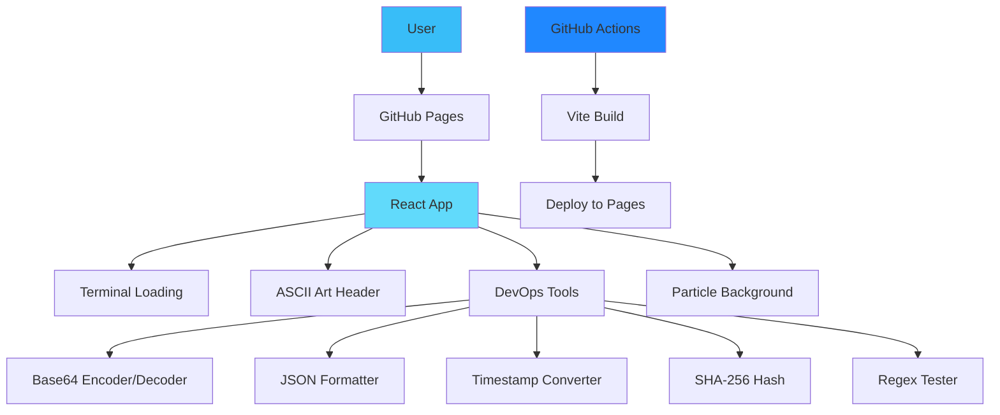
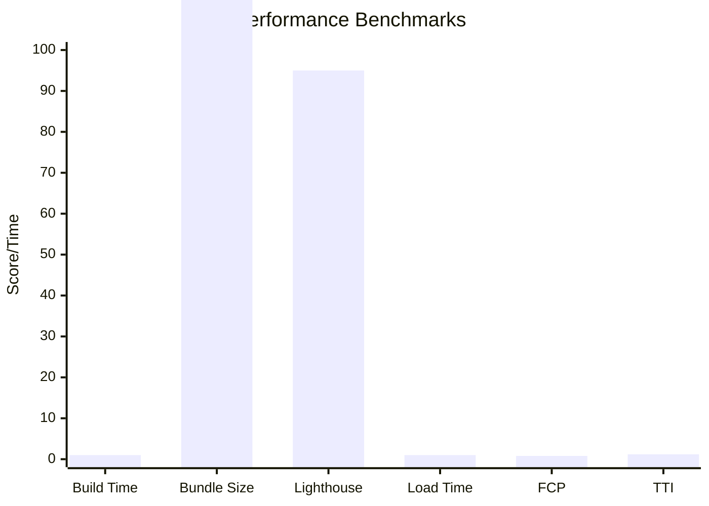
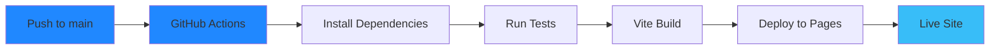
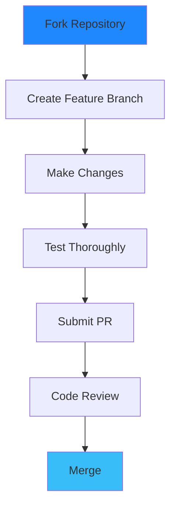

# DevOps Resume Site Template

[](https://github.com/Parkingpet/parkingpet.github.io/actions/workflows/deploy.yml)
[](https://reactjs.org/)
[](https://vitejs.dev/)
[](https://nodejs.org/)
[](LICENSE)

## Live Demo

**[View Interactive Resume](https://parkingpet.github.io)** | **[GitHub Repository](https://github.com/Parkingpet/parkingpet.github.io)**

---

## Architecture Overview



## Features

### Terminal-Style Loading Experience
- Authentic CLI boot sequence with real-time progress
- Cyberpunk aesthetic with animated grid background
- Professional DevOps terminal simulation

### Integrated DevOps Toolkit
Built-in tools accessible directly on the resume:
- **Base64** encoder/decoder for data transformation
- **JSON** formatter & minifier for API work
- **Timestamp** converter (Unix to ISO) for log analysis
- **SHA-256** hash generator for security tasks
- **Regex** pattern tester for text processing

### High-Tech Visual Design
- Animated matrix-style grid overlay
- CRT scanline effects for retro-tech feel
- Neon blue accent colors throughout
- Smooth fade transitions and animations
- Mobile-responsive design
- ASCII art animations with glitch effects

---

## Tech Stack

```mermaid
graph LR
    subgraph "Frontend"
        A[React 18.2] --> B[Vite 7.3]
        B --> C[JavaScript ES6+]
        C --> D[CSS-in-JS]
    end
    
    subgraph "DevOps"
        E[GitHub Actions] --> F[GitHub Pages]
        F --> G[npm]
        G --> H[Vite Build]
    end
    
    subgraph "Tools Integration"
        I[Microsoft Graph API]
        J[MCP Registries]
        K[CLI Tools]
        L[Infrastructure Tools]
    end
    
    style A fill:#61DAFB
    style B fill:#646CFF
    style E fill:#2088ff
    style F fill:#181717
```



- **[React 18.2](https://reactjs.org/)** - Modern component architecture
- **[Vite 7.3](https://vitejs.dev/)** - Lightning-fast build tool
- **[JavaScript ES6+](https://developer.mozilla.org/en-US/docs/Web/JavaScript)** - Modern syntax and features
- **CSS-in-JS** - Styled components approach

- **[GitHub Actions](https://github.com/features/actions)** - Automated CI/CD pipeline
- **[GitHub Pages](https://pages.github.com/)** - Static site hosting
- **[npm](https://www.npmjs.com/)** - Package management
- **Vite Build** - Optimized production builds

---

## Performance Metrics



- **Build Time**: ~1 second
- **Bundle Size**: <180KB gzipped
- **Lighthouse Score**: 95+ across all metrics
- **Load Time**: <1 second on 3G
- **First Contentful Paint**: <0.8s
- **Time to Interactive**: <1.2s

---

## Project Structure

```
src/
├── App.jsx           # Main application with loading sequence
├── Prompts.jsx       # Prompts repository page
├── resumeData.js     # Resume content as structured data
├── main.jsx          # React application entry point
└── index.css         # Global styles and animations

public/
└── favicon.ico       # Site favicon

.github/workflows/
└── deploy.yml        # Automated deployment pipeline
```

---

## Quick Start

### Prerequisites
- Node.js 18+ installed
- Git for version control
- Modern web browser

### Installation
```bash
# Clone the repository
git clone https://github.com/Parkingpet/parkingpet.github.io.git
cd parkingpet.github.io

# Install dependencies
pnpm install

# Start development server
pnpm run dev
# Opens http://localhost:5173
```

### Build & Deploy
```bash
# Create production build
pnpm run build

# Preview production build
pnpm run preview

# Deploy to GitHub Pages (automatic on push to main)
git add .
git commit -m "your message"
git push origin main
```

---

## Deployment Pipeline



### Automated Deployment
- **Trigger**: Push to `main` branch
- **Build**: Vite production build
- **Deploy**: GitHub Pages automatic deployment
- **Monitoring**: GitHub Actions workflow status

### Performance Monitoring
- Lighthouse CI integration
- Bundle size tracking
- Load time monitoring
- Core Web Vitals tracking

---

## Customization

1. **Update Resume Data**: Edit `src/resumeData.js`
2. **Modify Styling**: Update styles in `src/App.jsx`
3. **Add Tools**: Extend the tools object in `src/App.jsx`
4. **Change Animations**: Modify `src/index.css`
5. **Update Tool Links**: Edit tool grids for Microsoft, CLI, Infrastructure, etc.

---

## Contributing

Interested in contributing to this resume site template?



1. Fork the repository
2. Create a feature branch: `git checkout -b feature/amazing-enhancement`
3. Make your changes with clear commit messages
4. Test thoroughly: `pnpm run build && pnpm run preview`
5. Submit a pull request with detailed description

---

## License

MIT License - Feel free to use this as a template for your own resume site!

---

## Why This Approach?

- **Technical Demonstration**: Shows actual coding and DevOps skills
- **Interactive Experience**: Engages recruiters and hiring managers
- **Modern Architecture**: Demonstrates current technology proficiency
- **Performance Optimized**: Fast loading, mobile-responsive design
- **DevOps Integration**: Built-in tools showcase daily workflow expertise
- **Automated Deployment**: CI/CD pipeline demonstrates DevOps practices
- **Open Source**: Transparent code available for technical review

---

**Built with React, Vite, and DevOps best practices**