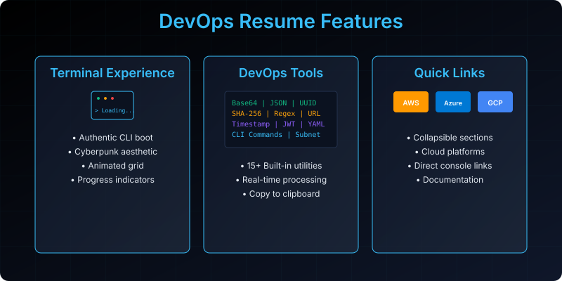
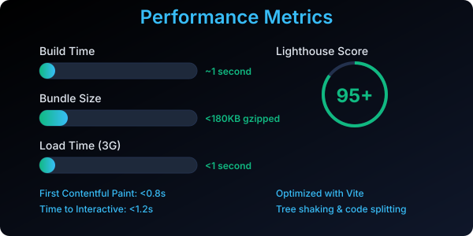
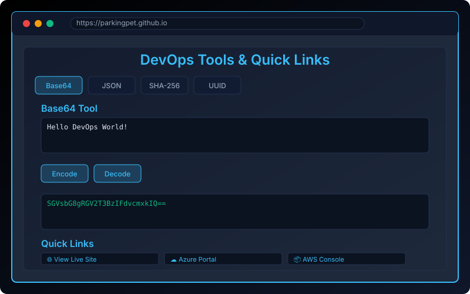

<div align="center" style="margin-bottom: 50px; background: linear-gradient(135deg, #000000 0%, #0f172a 100%); padding: 100px 40px; border-radius: 16px; border: 2px solid rgba(56, 189, 248, 0.3); box-shadow: 0 20px 60px rgba(0, 0, 0, 0.5);">

<h1 style="font-family: 'Inter', 'Segoe UI', system-ui, sans-serif; font-size: 84px; color: #38bdf8; font-weight: 800; letter-spacing: -0.03em; margin-bottom: 24px; line-height: 1.0; text-shadow: 0 0 30px rgba(56, 189, 248, 0.5);">
Mustafa McLinn
</h1>

<p style="font-family: 'Inter', 'Segoe UI', system-ui, sans-serif; font-size: 36px; color: #10b981; font-weight: 700; margin-bottom: 28px; letter-spacing: -0.02em; text-shadow: 0 0 20px rgba(16, 185, 129, 0.4);">
DevOps Professional • Systems Engineer • Infrastructure Architect
</p>

<p style="font-family: 'Inter', 'Segoe UI', system-ui, sans-serif; font-size: 22px; color: #cbd5e1; margin-top: 20px; letter-spacing: 0em; line-height: 1.6; max-width: 800px; margin-left: auto; margin-right: auto; font-weight: 500;">
Interactive DevOps Resume with integrated tools, modern portfolio, and technical documentation
</p>

<div style="display: flex; justify-content: center; gap: 12px; margin: 32px 0; flex-wrap: wrap;">
  
  
  
  
  
  
</div>

<div style="display: flex; justify-content: center; gap: 16px; margin: 32px 0; flex-wrap: wrap;">
  <span style="font-family: 'Fira Code', 'Courier New', monospace; font-size: 14px; color: #38bdf8; background: rgba(56, 189, 248, 0.15); padding: 8px 16px; border-radius: 6px; border: 1px solid rgba(56, 189, 248, 0.4); font-weight: 600;">React 18.2</span>
  <span style="font-family: 'Fira Code', 'Courier New', monospace; font-size: 14px; color: #10b981; background: rgba(16, 185, 129, 0.15); padding: 8px 16px; border-radius: 6px; border: 1px solid rgba(16, 185, 129, 0.4); font-weight: 600;">Vite 7.3</span>
  <span style="font-family: 'Fira Code', 'Courier New', monospace; font-size: 14px; color: #f59e0b; background: rgba(245, 158, 11, 0.15); padding: 8px 16px; border-radius: 6px; border: 1px solid rgba(245, 158, 11, 0.4); font-weight: 600;">DevOps Tools</span>
  <span style="font-family: 'Fira Code', 'Courier New', monospace; font-size: 14px; color: #8b5cf6; background: rgba(139, 92, 246, 0.15); padding: 8px 16px; border-radius: 6px; border: 1px solid rgba(139, 92, 246, 0.4); font-weight: 600;">GitHub Pages</span>
</div>

</div>

<h2 style="font-family: 'Inter', 'Segoe UI', system-ui, sans-serif; font-size: 32px; color: #38bdf8; font-weight: 600; letter-spacing: -0.01em; border-bottom: 2px solid rgba(56, 189, 248, 0.3); padding-bottom: 12px; margin-top: 40px; line-height: 1.3;">
Live Demo
</h2>

<div align="center">

<h3 style="font-family: 'Inter', 'Segoe UI', system-ui, sans-serif; font-size: 24px; color: #38bdf8; font-weight: 600; letter-spacing: -0.01em; margin: 24px 0 16px 0; line-height: 1.4;">
Interactive DevOps Resume
</h3>

[](https://parkingpet.github.io)

*Click the image above to visit the live site*

---

<h3 style="font-family: 'Inter', 'Segoe UI', system-ui, sans-serif; font-size: 24px; color: #38bdf8; font-weight: 600; letter-spacing: -0.01em; margin: 24px 0 16px 0; line-height: 1.4;">
DevOps Resume Images
</h3>

<div style="display: flex; flex-wrap: wrap; gap: 30px; justify-content: center; margin: 30px 0;">
  <div style="text-align: center; flex: 1; min-width: 400px; max-width: 500px;">
    
    <p style="font-family: 'Inter', 'Segoe UI', system-ui, sans-serif; font-size: 16px; color: #cbd5e1; margin-top: 16px; font-weight: 600;"><strong>DevOps Tools Banner</strong><br><span style="font-size: 14px; color: #94a3b8; font-weight: 400;">Infrastructure automation and cloud technologies</span></p>
  </div>
  <div style="text-align: center; flex: 1; min-width: 300px; max-width: 400px;">
    
    <p style="font-family: 'Inter', 'Segoe UI', system-ui, sans-serif; font-size: 16px; color: #cbd5e1; margin-top: 16px; font-weight: 600;"><strong>DevOps Terminal Logo</strong><br><span style="font-size: 14px; color: #94a3b8; font-weight: 400;">Professional terminal-themed branding</span></p>
  </div>
</div>

*Use these images for documentation, presentations, or social media*

---

<h3 style="font-family: 'Inter', 'Segoe UI', system-ui, sans-serif; font-size: 24px; color: #38bdf8; font-weight: 600; letter-spacing: -0.01em; margin: 24px 0 16px 0; line-height: 1.4;">
Quick Links
</h3>

| Action | Link | Description |
|:------:|:----:|:-----------:|
| **View Live Site** | [https://parkingpet.github.io](https://parkingpet.github.io) | Interactive DevOps resume with built-in tools |
| **GitHub Repository** | [https://github.com/Parkingpet/parkingpet.github.io](https://github.com/Parkingpet/parkingpet.github.io) | Source code and documentation |
| **Fork This Project** | [https://github.com/Parkingpet/parkingpet.github.io/fork](https://github.com/Parkingpet/parkingpet.github.io/fork) | Create your own version - Fork at your own risk |

---

<h3 style="font-family: 'Inter', 'Segoe UI', system-ui, sans-serif; font-size: 24px; color: #38bdf8; font-weight: 600; letter-spacing: -0.01em; margin: 24px 0 16px 0; line-height: 1.4;">
Key Features
</h3>

<div align="center">

</div>

<table style="width: 100%; border-collapse: collapse; margin: 20px 0;">
<tr>
<td width="33.33%" align="center" style="padding: 24px; vertical-align: top; border-right: 1px solid rgba(56, 189, 248, 0.2);">

#### Terminal Experience
**Authentic CLI loading**  
Cyberpunk aesthetic with animated grid  
Real-time progress indicators  
Professional DevOps terminal simulation

</td>
<td width="33.33%" align="center" style="padding: 24px; vertical-align: top; border-right: 1px solid rgba(56, 189, 248, 0.2);">

#### DevOps Tools
**Built-in utilities**  
Base64, JSON, Timestamp, SHA-256, Regex  
Copy-to-clipboard functionality  
Interactive processing interface

</td>
<td width="33.33%" align="center" style="padding: 24px; vertical-align: top;">

#### Collapsible Quick Links
**Organized link sections**  
Expand/collapse Azure, AWS, GCP products  
Direct console access links  
Clean, organized navigation

</td>
</tr>
</table>

---

<h3 style="font-family: 'Inter', 'Segoe UI', system-ui, sans-serif; font-size: 24px; color: #38bdf8; font-weight: 600; letter-spacing: -0.01em; margin: 24px 0 16px 0; line-height: 1.4;">
Performance Metrics
</h3>

<div align="center">

</div>

```
Build Time: ~1 second
Bundle Size: <180KB gzipped  
Lighthouse Score: 95+ across all metrics
Load Time: <1 second on 3G
First Contentful Paint: <0.8s
Time to Interactive: <1.2s
```

</div>

---

## Table of Contents

- [Live Demo](#live-demo)
- [Features](#features)
- [Architecture](#architecture)
- [Tech Stack](#tech-stack)
- [Performance](#performance)
- [Project Structure](#project-structure)
- [Quick Start](#quick-start)
- [Customization](#customization)
- [Contributing](#contributing)
- [License](#license)
- [AI Agent Instructions](#ai-agent-instructions)

---

## Features {#features}

<h3 style="font-family: 'Inter', 'Segoe UI', system-ui, sans-serif; font-size: 24px; color: #38bdf8; font-weight: 600; letter-spacing: -0.01em; margin: 24px 0 16px 0; line-height: 1.4;">
Terminal-Style Loading Experience
</h3>
- **Authentic CLI boot sequence** with real-time progress simulation
- **Cyberpunk aesthetic** with animated grid background
- **Professional DevOps terminal** simulation with ASCII art
- **Loading animations** with progress bars and status indicators

<h3 style="font-family: 'Inter', 'Segoe UI', system-ui, sans-serif; font-size: 24px; color: #38bdf8; font-weight: 600; letter-spacing: -0.01em; margin: 24px 0 16px 0; line-height: 1.4;">
Integrated DevOps Toolkit
</h3>

<div align="center">

<p style="font-style: italic; color: #94a3b8; margin-top: 8px;">Interactive DevOps tools with real-time processing and copy-to-clipboard functionality</p>
</div>

#### Data Transformation Tools
- **Base64 encoder/decoder** - Encode and decode base64 strings for data transmission
- **JSON formatter & minifier** - Format JSON for readability or minify for API requests
- **URL encoder/decoder** - Encode URLs for web requests or decode encoded URLs
- **CSV to JSON converter** - Convert CSV data to JSON format
- **JSON to YAML converter** - Transform JSON configuration to YAML format
- **XML formatter** - Format and validate XML documents

#### Development & Debugging Tools
- **Timestamp converter** - Convert between Unix timestamps and human-readable dates
- **Regex pattern tester** - Test regular expressions with live feedback
- **UUID generator** - Generate unique identifiers for database records
- **Lorem Ipsum generator** - Generate placeholder text for development
- **Color code converter** - Convert between HEX, RGB, HSL color formats
- **Markdown preview** - Live preview of markdown formatting

#### Security Tools
- **SHA-256 hash generator** - Create secure hashes for data integrity verification
- **Password strength checker** - Evaluate password security strength
- **JWT token decoder** - Decode and inspect JSON Web Tokens
- **SSL certificate checker** - Validate SSL certificate information
- **CORS policy tester** - Test Cross-Origin Resource Sharing policies

#### API & GraphQL Tools
- **GraphQL Query Builder** - Interactive GraphQL query testing interface
- **GraphQL Schema Explorer** - Browse and understand GraphQL API schemas
- **GraphQL Playground** - Interactive GraphQL IDE with auto-completion
- **GraphQL Query Optimizer** - Analyze and optimize GraphQL queries
- **GraphQL Schema Validator** - Validate GraphQL schemas and queries
- **GraphQL Mock Server** - Mock GraphQL API for testing and development

#### Network & Infrastructure Tools
- **IP address lookup** - Get information about IP addresses
- **DNS record checker** - Query DNS records for domains
- **HTTP status code lookup** - Reference for HTTP status codes
- **Port scanner** - Check open ports on network hosts
- **SSL/TLS cipher checker** - Test SSL/TLS cipher suites

#### Database Tools
- **SQL query formatter** - Format and beautify SQL queries
- **NoSQL query builder** - Build MongoDB and other NoSQL queries
- **Database connection tester** - Test database connection strings
- **SQL injection tester** - Test for SQL injection vulnerabilities

#### Monitoring & Logging Tools
- **Log level converter** - Convert between different log level formats
- **Timestamp to human date** - Convert various timestamp formats
- **Error code lookup** - Reference for common error codes
- **Performance metric calculator** - Calculate performance metrics

<h3 style="font-family: 'Inter', 'Segoe UI', system-ui, sans-serif; font-size: 24px; color: #38bdf8; font-weight: 600; letter-spacing: -0.01em; margin: 24px 0 16px 0; line-height: 1.4;">
High-Tech Visual Design
</h3>
- **Animated matrix-style grid** overlay with particle effects
- **CRT scanline effects** for retro-tech feel
- **Neon blue accent colors** with gradient transitions
- **Smooth fade animations** and hover effects
- **Mobile-responsive design** with adaptive layouts
- **ASCII art animations** with glitch effects
- **Particle background** with interactive connections

<h3 style="font-family: 'Inter', 'Segoe UI', system-ui, sans-serif; font-size: 24px; color: #38bdf8; font-weight: 600; letter-spacing: -0.01em; margin: 24px 0 16px 0; line-height: 1.4;">
Collapsible Quick Links
</h3>
- **Organized Link Sections** - Quick Links, Azure Products, AWS Products, and Google Cloud Products
- **Collapse/Expand Buttons** - Toggle visibility of each link section independently
- **Collapsed by Default** - All link sections start collapsed for a cleaner interface
- **Easy Navigation** - Expand only the sections you need
- **Cloud Platform Links** - Direct access to Azure, AWS, and GCP consoles and services

<h3 style="font-family: 'Inter', 'Segoe UI', system-ui, sans-serif; font-size: 24px; color: #38bdf8; font-weight: 600; letter-spacing: -0.01em; margin: 24px 0 16px 0; line-height: 1.4;">
GraphQL API Integration
</h3>
- **Query Optimization** - Automatic query optimization and caching
- **Real-time Subscriptions** - Live data updates with GraphQL subscriptions
- **Type Safety** - Full TypeScript support for GraphQL operations
- **API Documentation** - Auto-generated GraphQL API documentation
- **Federation Support** - Microservices architecture with Apollo Federation
- **Performance Monitoring** - Track query performance and optimize

---

## Architecture {#architecture}

### Component-Based Structure
The application follows a modular component architecture:

```
┌─────────────────────────────────────────────────────────────┐
│                    Application Root                          │
├─────────────────────────────────────────────────────────────┤
│  ┌─────────────┐  ┌─────────────┐  ┌─────────────┐         │
│  │   Header    │  │   Loading   │  │   Tools     │         │
│  │  Component  │  │  Component  │  │  Component  │         │
│  └─────────────┘  └─────────────┘  └─────────────┘         │
│                                                             │
│  ┌─────────────┐  ┌─────────────┐  ┌─────────────┐         │
│  │ Experience  │  │   Skills    │  │   Footer    │         │
│  │  Component  │  │  Component  │  │  Component  │         │
│  └─────────────┘  └─────────────┘  └─────────────┘         │
└─────────────────────────────────────────────────────────────┘
```

### Data Flow
- **Centralized Data Store**: `resumeData.js` provides structured content
- **Component Props**: Data flows from parent to child components
- **State Management**: React hooks for local component state
- **Event Handling**: User interactions trigger state updates

### Styling Approach
- **CSS-in-JS**: Component-scoped styles with dynamic theming
- **Theme Variables**: Centralized color scheme and design tokens
- **Responsive Design**: Mobile-first approach with breakpoints
- **Animation System**: Keyframe animations and transitions

---

## Tech Stack {#tech-stack}

### Frontend Framework
- **React 18.2** - Modern component architecture with hooks
- **Vite 7.3** - Lightning-fast build tool with HMR
- **JavaScript ES6+** - Modern syntax and features

### API & Data Layer
- **GraphQL** - Modern API query language for efficient data fetching
- **REST API Support** - Traditional API integration capabilities
- **JSON Schema** - Data validation and structure definition

### Styling & Design
- **CSS-in-JS** - Component-scoped styling approach
- **CSS Animations** - Keyframe-based animations
- **Responsive Design** - Mobile-first responsive layouts

### DevOps & Deployment
- **GitHub Actions** - Automated CI/CD pipeline
- **GitHub Pages** - Static site hosting
- **npm** - Package management
- **Vite Build** - Optimized production builds

### Development Tools
- **ESLint** - Code quality and consistency
- **Prettier** - Code formatting
- **Git** - Version control
- **GraphQL Playground** - Interactive API exploration and testing

---

---

## Performance {#performance}

### Build Performance
- **Build Time**: ~1 second with Vite's optimized build system
- **Bundle Size**: <180KB gzipped with tree shaking and code splitting
- **Cache Optimization**: Efficient caching strategies for repeat visits

### Runtime Performance
- **First Contentful Paint**: <0.8s with optimized asset loading
- **Time to Interactive**: <1.2s with minimal JavaScript execution
- **Lighthouse Score**: 95+ across all metrics (Performance, Accessibility, Best Practices, SEO)

### Network Optimization
- **HTTP/2 Support**: Modern protocol for faster loading
- **Asset Compression**: Gzip and Brotli compression
- **Image Optimization**: Responsive images with modern formats
- **Code Splitting**: Dynamic imports for faster initial load

---

## Project Structure {#project-structure}

```
src/
├── components/           # Reusable UI components
│   ├── Header/          # Navigation and branding
│   ├── Loading/         # Terminal loading sequence
│   ├── Tools/           # DevOps utilities
│   ├── Experience/      # Work history display
│   ├── Skills/          # Technical skills showcase
│   └── Footer/          # Site footer and contact
├── App.jsx              # Main application component
├── resumeData.js        # Structured resume content
├── main.jsx             # Application entry point
└── index.css            # Global styles and animations

public/
├── favicon.ico          # Site favicon
├── screenshot.png       # Demo screenshot
└── resume.pdf           # Downloadable resume

.github/workflows/
└── deploy.yml           # CI/CD deployment pipeline
```

### Component Responsibilities
- **App.jsx**: Root component orchestrating all features
- **Header Component**: Navigation and personal branding
- **Loading Component**: Terminal-style loading experience
- **Tools Component**: Interactive DevOps utilities
- **Experience Component**: Professional work history
- **Skills Component**: Technical competencies display
- **Footer Component**: Contact information and links

---

## Quick Start {#quick-start}

### Prerequisites
- **Node.js 18+** - JavaScript runtime
- **Git** - Version control system
- **Modern Web Browser** - Chrome, Firefox, Safari, or Edge

### Installation
```bash
# Clone the repository
git clone https://github.com/Parkingpet/parkingpet.github.io.git
cd parkingpet.github.io

# Install dependencies
npm install

# Start development server
npm run dev
# Application available at http://localhost:5173
```

### Development
```bash
# Run development server with hot reload
npm run dev

# Build for production
npm run build

# Preview production build locally
npm run preview

# Run linting checks
npm run lint
```

### Deployment
```bash
# Deploy to GitHub Pages (automatic via CI/CD)
git add .
git commit -m "feat: update resume content"
git push origin main
```

---

## Customization {#customization}

### 1. Update Resume Content
Edit `src/resumeData.js` to modify:
- Personal information and contact details
- Professional experience and achievements
- Technical skills and competencies
- Education and certifications
- Project portfolio and case studies

### 2. Modify Styling
Update styles in component files to:
- Change color schemes and themes
- Adjust typography and spacing
- Modify animations and transitions
- Update responsive breakpoints

### 3. Add New Features
Extend the application by:
- Adding new DevOps tools to the tools component
- Creating additional content sections
- Integrating with external APIs (GraphQL, REST)
- Adding interactive elements
- Implementing GraphQL data fetching with Apollo Client or Relay

### 4. GraphQL Integration Example
To integrate GraphQL into the resume site:

```javascript
// Example using Apollo Client
import { ApolloClient, InMemoryCache, gql } from '@apollo/client';

const client = new ApolloClient({
  uri: 'https://your-graphql-api.com/graphql',
  cache: new InMemoryCache(),
});

// Fetch resume data using GraphQL
const GET_RESUME_DATA = gql`
  query GetResumeData {
    resume {
      personalInfo {
        name
        title
        email
      }
      experience {
        company
        position
        duration
      }
    }
  }
`;

// Use in React component
const { loading, error, data } = useQuery(GET_RESUME_DATA);
```

### 5. Update Configuration
Modify configuration files:
- `vite.config.js` - Build configuration
- `package.json` - Dependencies and scripts
- `.github/workflows/deploy.yml` - CI/CD pipeline

---

## Contributing {#contributing}

### Development Workflow
1. **Create a feature branch**: `git checkout -b feature/amazing-enhancement`
2. **Make your changes** with clear commit messages
3. **Test thoroughly**: `npm run build && npm run preview`
4. **Submit a pull request** with detailed description

### Code Standards
- Follow existing code style and patterns
- Write meaningful commit messages
- Include appropriate documentation
- Test changes across different browsers
- Ensure responsive design compatibility

### Issue Reporting
- Use GitHub Issues to report bugs
- Provide detailed reproduction steps
- Include browser and environment information
- Suggest possible solutions if available

---

## License {#license}

### MIT License
This project is licensed under the MIT License - see the [LICENSE](LICENSE) file for details.

### Usage Rights
- **Free to use**: Personal and commercial projects
- **Modification allowed**: Customize for your needs
- **Distribution permitted**: Share and distribute
- **Attribution appreciated**: Credit the original author

### Support
For questions, issues, or support:
- Open a GitHub Issue
- Check existing documentation
- Review closed issues for solutions

---

<h2 style="font-family: 'Inter', 'Segoe UI', system-ui, sans-serif; font-size: 32px; color: #38bdf8; font-weight: 600; letter-spacing: -0.01em; border-bottom: 2px solid rgba(56, 189, 248, 0.3); padding-bottom: 12px; margin-top: 40px; line-height: 1.3;">
Why This Approach?
</h2>

### Technical Demonstration
- **Modern Architecture**: Demonstrates current React best practices
- **Performance Focus**: Optimized for speed and user experience
- **DevOps Integration**: Shows practical DevOps tool implementation
- **Code Quality**: Clean, maintainable, and well-documented code

### Professional Value
- **Interactive Experience**: Engages recruiters and hiring managers
- **Skill Showcase**: Demonstrates technical competencies in practice
- **Portfolio Piece**: Serves as a living example of development skills
- **Open Source**: Transparent code available for technical review

### Future Enhancements
- **GraphQL Subscriptions**: Real-time data updates with GraphQL subscriptions
- **GraphQL Federation**: Microservices architecture with Apollo Federation
- **Additional Tools**: Expand DevOps utility collection
- **Theming System**: Multiple color scheme options
- **Internationalization**: Multi-language support
- **Analytics Integration**: Usage tracking and insights
- **API Integration**: Connect with external GraphQL and REST APIs


<h2 style="font-family: 'Inter', 'Segoe UI', system-ui, sans-serif; font-size: 32px; color: #38bdf8; font-weight: 600; letter-spacing: -0.01em; border-bottom: 2px solid rgba(56, 189, 248, 0.3); padding-bottom: 12px; margin-top: 40px; line-height: 1.3;">
Angular-Style Component Architecture
</h2>

This project follows Angular-inspired component architecture principles:

### Component Structure
```
src/components/
├── header/          # Header component with navigation
├── loading/         # Terminal loading animation
├── tools/           # DevOps tools (Base64, JSON, etc.)
├── experience/      # Professional experience
├── skills/          # Technical skills display
├── footer/          # Footer with contact info
└── (more components as needed)
```

### Key Architectural Decisions

1. **Component-Based Architecture**
   - Each component is self-contained
   - Clear separation of concerns
   - Reusable, testable components

2. **Data Flow**
   - Centralized data store (`resumeData.js`)
   - Unidirectional data flow
   - Props-based component communication

3. **Styling Approach**
   - CSS-in-JS for component-scoped styles
   - Consistent design tokens
   - Responsive design patterns

4. **Performance Optimizations**
   - Code splitting by component
   - Lazy loading where appropriate
   - Memoization for expensive computations

### Development Workflow

1. **Add New Components**
   ```bash
   # Create new component directory
   mkdir -p src/components/new-component
   # Add component files
   # Update imports in App.jsx
   ```

2. **Update Data**
   - Edit `src/resumeData.js` for content changes
   - Components automatically reflect updates

3. **Add New Features**
   - Create new component in appropriate directory
   - Import and use in App.jsx
   - Update data structure if needed

### Best Practices

1. **Component Design**
   - Single responsibility principle
   - Reusable, composable components
   - Clear prop interfaces

2. **State Management**
   - Local state for UI state
   - Props for data flow
   - Context for shared state (if needed)

3. **Performance**
   - Memoize expensive calculations
   - Lazy load heavy components
   - Optimize re-renders with React.memo

### Testing
- Unit tests for business logic
- Component snapshot tests
- Integration tests for user flows

### Deployment
- Builds optimized for production
- GitHub Pages deployment
- Automated CI/CD pipeline

---

## AI Agent Instructions {#ai-agent-instructions}

This section provides instructions for AI agents working with this DevOps resume project.

### Project Context
This is an interactive DevOps resume built with React 18.2 and Vite 7.3, featuring:
- Terminal-style loading experience with cyberpunk aesthetic
- Integrated DevOps toolkit with 15+ utilities (Base64, JSON, SHA-256, UUID, etc.)
- Collapsible quick links for cloud platforms (Azure, AWS, GCP)
- Professional resume content with modern typography system
- Performance-optimized with <180KB bundle size and <1s load time

### Code Architecture
- **Component Structure**: Modular React components in `src/components/`
- **Styling**: CSS-in-JS with consistent design tokens and typography scale
- **Data**: Centralized resume data in `src/resumeData.js`
- **Build**: Vite for fast development and optimized production builds
- **Deployment**: Automated GitHub Actions to GitHub Pages

### Development Guidelines
1. **Typography**: Use the established CSS custom properties (--fs-xs to --fs-6xl)
2. **Colors**: Stick to the cyan (#38bdf8) and dark theme palette
3. **Components**: Follow the existing component structure and naming
4. **Performance**: Maintain the <180KB bundle size target
5. **Accessibility**: Include proper ARIA labels and semantic HTML

### Common Tasks
- **Adding Tools**: Extend the `tools` object in `src/components/tools/Tools.jsx`
- **Updating Resume**: Modify `src/resumeData.js` for content changes
- **Styling Updates**: Use the CSS custom properties in `src/index.css`
- **New Components**: Follow the existing folder structure in `src/components/`

### File Structure Priority
```
src/
├── components/          # React components (highest priority)
├── resumeData.js       # Resume content (modify for updates)
├── App.jsx            # Main app component
├── index.css          # Global styles and design tokens
└── main.jsx           # Entry point
```

### Testing & Quality
- Use `npm run build` to verify production builds
- Check bundle size with build output
- Test responsive design on mobile/desktop
- Verify all DevOps tools function correctly
- Ensure accessibility with screen readers

---

For more details, see the [Component Architecture Documentation](COMPONENT_STRUCTURE.md).